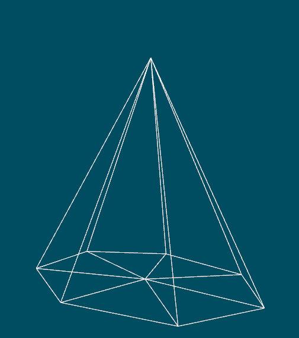
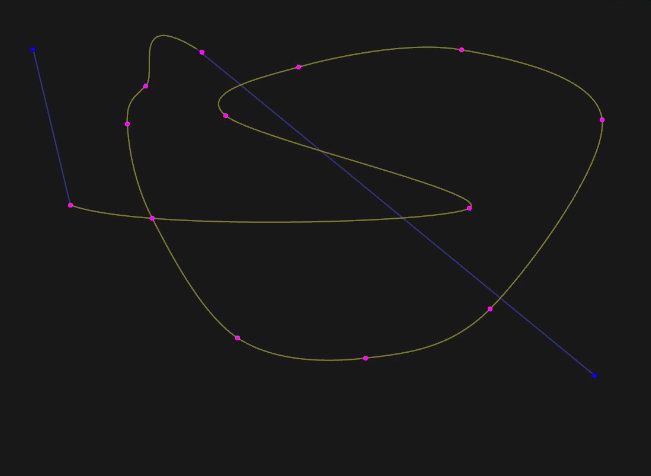
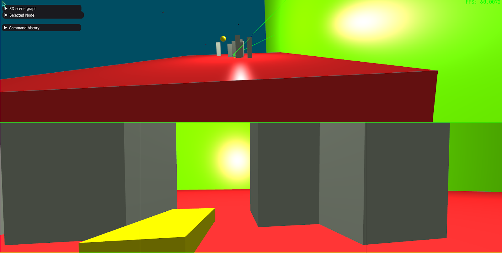
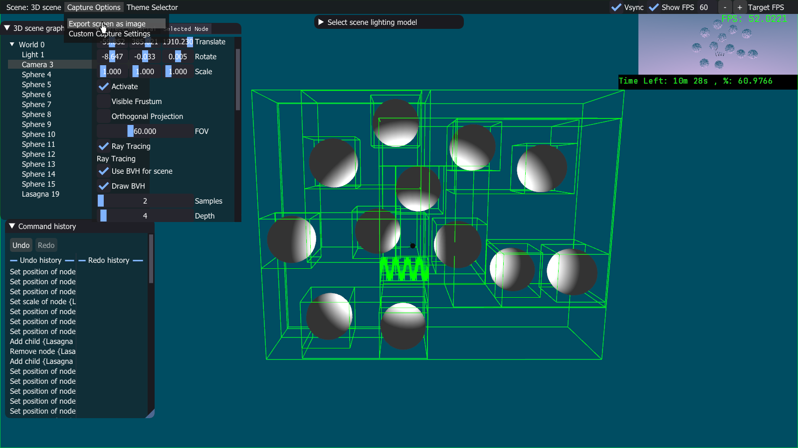
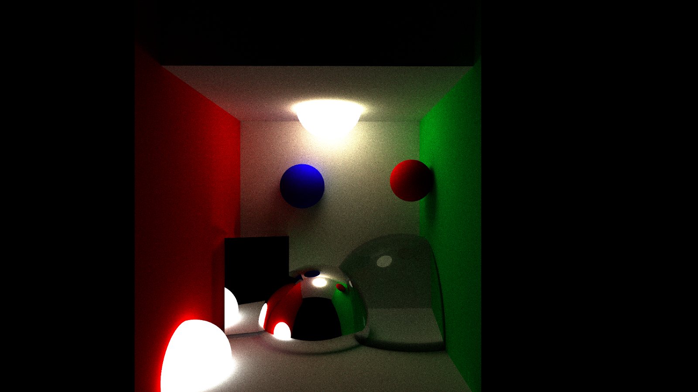
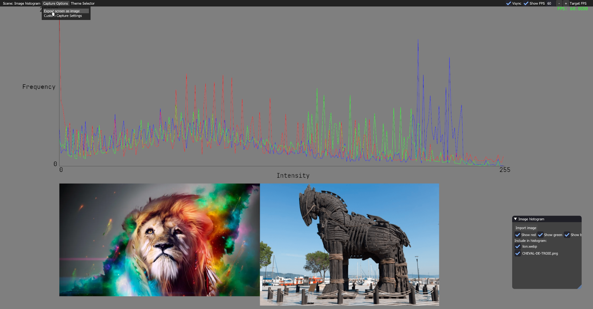

Projet infographie -- Équipe 7 -- IFT-3100

# 🎬 Demo
---
### 1. 3D Primitives



#### Different primitives implemented: sphere, cube, pyramid, lasagna

### 2. Parametric curves


#### Catmull-Rom curve implemented

### 3. Camera


#### Use of one or multiple cameras in the scene

### 4. BVH


#### BVH implemented to optimise ray tracing

### 5. Lighting


#### Different lighting techniques

### 6. Textures


#### Various texture types, including this procedural texture

### 8. Ray Tracing



#### Ray tracing implemented with different materials (with reflection, refraction and diffusion)

### 9. Histogram


#### Histogram implemented for imported images


## Instructions to run the project
### Requirements:
- [openframeworks 0.12.x](https://openframeworks.cc/download/) (recommended Visual Studio on Windows, Xcode on MacOS, qtcreator on Linux)

### Steps (for Windows):
1. Clone the [`ofxImGui`](https://github.com/jvcleave/ofxImGui) repository inside your `/addons` folder of your openframeworks installation.
2. Clone the [`ofxDelaunay`](https://github.com/obviousjim/ofxDelaunay) repository inside your `/addons` folder of your openframeworks installation.
3. Clone this repository in the `/apps` folder of your openframeworks installation.
4. Open the `projectGenerator` tool in the `/projectGenerator` folder of your openframeworks installation.
5. Go to the `create / update` tab.
6. Click on `import` and select the folder in which you cloned this repository (located at `/apps/projet-infographie` of your oF install folder if the repository folder was not renamed).
7. Add the `ofxImGui` and `ofxAssimpModelLoader` and `ofxDelaunay` addons.
8. Click on `update` to generate the project files (Visual Studio solution).
9. Delete the `ofApp.h` and `ofApp.cpp` files in the `src` folder of the generated project.
10. Build and run the project.

### Steps (for Ubuntu):
1. download [openframeworks](https://openframeworks.cc/download/), on Kubuntu 24.04 (and probably other recent debian based distros) the OF Nightly Release version is required because of the problem shown at step 3
2. go to `{your openframeworks folder}/scripts/linux/ubuntu` (or corresponding distro)
3. run
```sh
sudo apt update
sudo ./install_dependencies.sh
```

if this step fails with
```sh
Installing libgconf-2-4
E: Unable to locate package libgconf-2-4
error installing libgconf-2-4
Reading package lists... Building dependency tree... Reading state information...
this seems an error with your distribution repositories but you can also
report an issue in the openFrameworks github: http://github.com/openframeworks/openFrameworks/issues
```

you need to install the [nightly version of openframeworks](https://github.com/openframeworks/openFrameworks/releases/tag/nightly) instead of the latest release on the website.

4. got to `{your openframeworks folder}/scripts/linux`
5. compile openframeworks with
```
./compileOF.sh -j4
```

6. on linux, you can compile a cli version of the project generator. To do so, go to `{your openframeworks folder}/scripts/linux` and run
```sh
./compilePG.sh
```

7. Clone the [`ofxImGui`](https://github.com/jvcleave/ofxImGui) repository inside your `/addons` folder of your openframeworks installation. You need to clone the `develop` branch for it to work. To do so, run this command:
```sh
git clone -b develop https://github.com/jvcleave/ofxImGui.git
```

8. Clone the [`ofxDelaunay`](https://github.com/obviousjim/ofxDelaunay) repository inside your `/addons` folder of your openframeworks installation. 
```sh
git clone https://github.com/obviousjim/ofxDelaunay
```

9. Clone [this repository](https://github.com/IFT-3100-Equipe-7-H2025/projet-infographie) in the `/apps` folder of your openframeworks installation.

10. Open the `projectGenerator` tool in the `projectGenerator-linux64` folder at the root of your openframeworks folder.

11. Go to the `create / update` tab.

12. Click on `import` and select the folder in which you cloned this repository (located at `/apps/projet-infographie` of your oF install folder if the repository folder was not renamed).

13. Add the ofxImGui and ofxAssimpModelLoader and ofxDelaunay addons.

14. Make sure the platforms is set to `Linux 64 (VS Code/Make)`.

15. Click on update to generate the project files.

16. If they were created, delete the `ofApp.h` and `ofApp.cpp` files in the `src` folder of the generated project.

17. Setup it up with qtcreator if you want. I personally tested it directly with the makefile running these commands:
```sh
make -j4
make run
```

18. If you want to use vscode, you can do the following setup:
- Install `compiledb` with pip:
```sh
pip install compiledb
```
if you get the error `error: externally-managed-environment`, rerun the pip install command with the `--break-system-packages` flag.

- Generate the `compile_commands.json` file with (while being at the root of the project):
```sh
python -m compiledb make
```

- Install the `C/C++` vscode extension.
- Open the file `./.vscode/c_cpp_properties.json` file and add the `compileCommands` entry in the `Linux` configuration part with the value `"compileCommands": "${workspaceFolder}/compile_commands.json"`. See this page and search for `compileCommands` in the file example if you are unsure about what this means: [https://code.visualstudio.com/docs/cpp/c-cpp-properties-schema-reference](https://code.visualstudio.com/docs/cpp/c-cpp-properties-schema-reference)

- You should now have proper highlighting and file resolution for openframeworks.

- To build and run the application, you can run the script:
```sh
./build_and_run.sh
```
or simply:
```sh
make -j4 && make run
```
